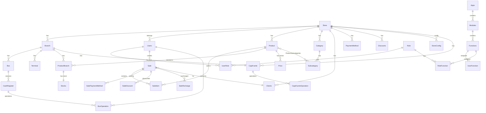
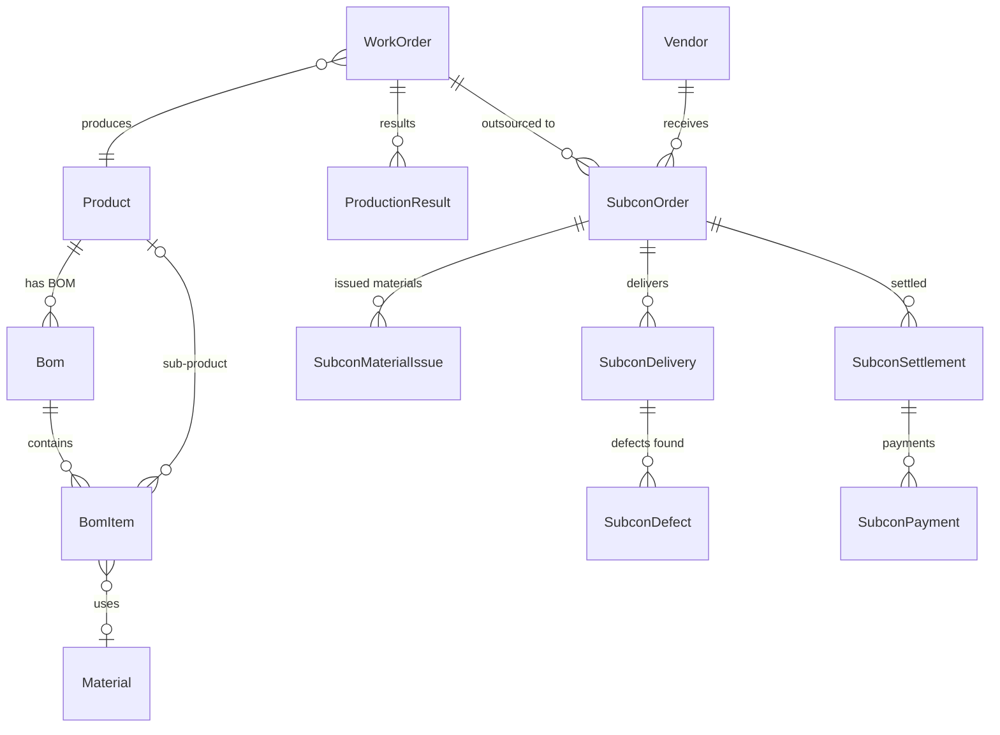
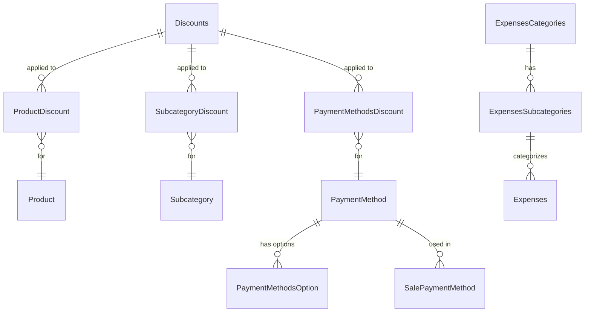

# ACE Online 1.0 - 데이터베이스 스키마 문서

> **최종 업데이트:** 2026-03-27
> **기술 스택:** PostgreSQL + Sequelize ORM (sequelize-typescript)
> **백엔드:** NestJS 11.x + TypeScript
> **모델 위치:** `api-ventago/src/app/*/`

---

## 목차

1. [개요](#개요)
2. [사용자/인증 도메인](#1-사용자인증-도메인)
3. [매장/지점 도메인](#2-매장지점-도메인)
4. [상품 도메인](#3-상품-도메인)
5. [판매 도메인](#4-판매-도메인)
6. [보류 판매 도메인](#5-보류-판매-도메인)
7. [고객 도메인](#6-고객-도메인)
8. [결제/금전 관리 도메인](#7-결제금전-관리-도메인)
9. [할인/추가요금 도메인](#8-할인추가요금-도메인)
10. [비용 도메인](#9-비용-도메인)
11. [생산/MES 도메인](#10-생산mes-도메인)
12. [외주(Talleres) 도메인](#11-외주talleres-도메인)
13. [채팅/AI 도메인](#12-채팅ai-도메인)
14. [감사 로그 도메인](#13-감사-로그-도메인)
15. [ERD 관계 다이어그램](#erd-관계-다이어그램)

---

## 개요

ACE Online 1.0은 의류/소매업 POS/ERP 시스템으로, 멀티 테넌트(multi-tenant) 구조를 사용합니다.
대부분의 테이블에 `storeId` FK가 있어 매장별 데이터가 격리됩니다.

**공통 규칙:**
- 모든 테이블에 `id` (AUTO_INCREMENT PK), `createdAt`, `updatedAt` 컬럼 포함
- CASCADE 삭제가 대부분의 FK에 적용됨
- 분류 테이블(Color, Size, Season 등)은 `(name, storeId)` 유니크 인덱스 사용

---

## 1. 사용자/인증 도메인

### 1.1 Users (사용자)
> 모델: `users/users.model.ts`

| 컬럼 | 타입 | Nullable | 기본값 | 설명 |
|------|------|----------|--------|------|
| id | INTEGER | NO | AUTO_INCREMENT | PK |
| name | STRING | NO | - | 이름 |
| lastName | STRING | YES | - | 성 |
| username | STRING | YES | - | 사용자명 (UNIQUE) |
| email | STRING | NO | - | 이메일 (UNIQUE) |
| password | STRING | NO | - | 비밀번호 (해시) |
| status | ENUM | NO | 'active' | 상태: active, inactive, trial, suspended |
| isVerified | BOOLEAN | NO | - | 이메일 인증 여부 |
| lastLoginAt | DATE | YES | - | 마지막 로그인 |
| trialEndsAt | DATE | YES | - | 체험판 종료일 |
| onboardingCompleted | BOOLEAN | NO | false | 온보딩 완료 여부 |
| storeId | INTEGER | YES | - | FK → Store |
| branchId | INTEGER | YES | - | FK → Branch |

**관계:** HasMany(UserRole, UserFunction, Sale, Movements, BoxOperation, ChatMessage)

---

### 1.2 Role (역할)
> 모델: `role/role.model.ts`

| 컬럼 | 타입 | Nullable | 기본값 | 설명 |
|------|------|----------|--------|------|
| id | INTEGER | NO | AUTO_INCREMENT | PK |
| name | STRING | NO | - | 역할명 |
| slug | STRING | NO | - | URL용 슬러그 |
| storeId | INTEGER | YES | - | 매장별 커스텀 역할 |

**관계:** HasMany(UserRole, RoleFunction)

---

### 1.3 UserRole (사용자-역할 매핑)
> 모델: `users/user-role/user-role.model.ts`

| 컬럼 | 타입 | Nullable | 기본값 | 설명 |
|------|------|----------|--------|------|
| id | INTEGER | NO | AUTO_INCREMENT | PK |
| userId | INTEGER | NO | - | FK → Users |
| roleId | INTEGER | NO | - | FK → Role |

---

### 1.4 Apps (애플리케이션 모듈)
> 모델: `apps/apps.model.ts`

| 컬럼 | 타입 | Nullable | 기본값 | 설명 |
|------|------|----------|--------|------|
| id | INTEGER | NO | AUTO_INCREMENT | PK |
| name | STRING | YES | - | 앱 이름 |
| slug | STRING | YES | - | 자동 생성 슬러그 |
| color | STRING | YES | - | UI 표시 색상 |
| description | STRING | YES | - | 설명 |

**관계:** HasMany(Modules, StoreApps)

---

### 1.5 Modules (모듈)
> 모델: `modules/modules.model.ts`

| 컬럼 | 타입 | Nullable | 기본값 | 설명 |
|------|------|----------|--------|------|
| id | INTEGER | NO | AUTO_INCREMENT | PK |
| name | STRING | YES | - | 모듈명 |
| slug | STRING | YES | - | 슬러그 |
| description | STRING | YES | - | 설명 |
| icon | STRING | YES | - | 아이콘 |
| url | STRING | YES | - | 라우트 URL |
| isMain | BOOLEAN | YES | - | 메인 모듈 여부 |
| appId | INTEGER | YES | - | FK → Apps |

**관계:** HasMany(Functions)

---

### 1.6 Functions (기능/권한 단위)
> 모델: `functions/functions.model.ts`

| 컬럼 | 타입 | Nullable | 기본값 | 설명 |
|------|------|----------|--------|------|
| id | INTEGER | NO | AUTO_INCREMENT | PK |
| name | STRING | YES | - | 기능명 |
| slug | STRING | YES | - | 자동 생성 슬러그 |
| description | STRING | YES | - | 설명 |
| moduleId | INTEGER | YES | - | FK → Modules |

**관계:** HasMany(UserFunction, RoleFunction)

---

### 1.7 UserFunction (사용자별 기능 권한)
> 모델: `users/user-function/user-function.model.ts`

| 컬럼 | 타입 | Nullable | 기본값 | 설명 |
|------|------|----------|--------|------|
| id | INTEGER | NO | AUTO_INCREMENT | PK |
| userId | INTEGER | YES | - | FK → Users |
| functionId | INTEGER | YES | - | FK → Functions |
| storeId | INTEGER | YES | - | 매장 컨텍스트 |
| allowed | BOOLEAN | NO | true | 허용 여부 |

---

### 1.8 RoleFunction (역할별 기능 권한)
> 모델: `role/role-function/role-function.model.ts`

| 컬럼 | 타입 | Nullable | 기본값 | 설명 |
|------|------|----------|--------|------|
| id | INTEGER | NO | AUTO_INCREMENT | PK |
| roleId | INTEGER | YES | - | FK → Role |
| functionId | INTEGER | YES | - | FK → Functions |
| storeId | INTEGER | YES | - | 매장 컨텍스트 |

---

## 2. 매장/지점 도메인

### 2.1 Store (매장)
> 모델: `store/store.model.ts`

| 컬럼 | 타입 | Nullable | 기본값 | 설명 |
|------|------|----------|--------|------|
| id | INTEGER | NO | AUTO_INCREMENT | PK |
| name | STRING | NO | - | 매장명 |
| aliasName | STRING | NO | - | 별칭 |
| cuit | BIGINT | NO | - | 세금 번호(아르헨티나 CUIT) |
| address | STRING | NO | - | 주소 |
| isActive | BOOLEAN | YES | - | 활성 상태 |
| integration | STRING | NO | - | 통합 유형 |
| status | STRING | NO | - | 상태 |
| typeOfPayer | STRING | NO | - | 납세자 유형 |
| startActivitiesDate | DATE | YES | - | 사업 시작일 |
| incomeNumber | BIGINT | YES | - | 소득 번호 |

**관계:** HasMany(Branch, Users, Product, Category, Color, Size, Season, Origin, Supplier, Sale, Clients, PaymentMethod, Discounts, Expenses, StoreConfig, StoreIntegrations, StoreApps, CajaFuerte)

---

### 2.2 Branch (지점)
> 모델: `branch/branch.model.ts`

| 컬럼 | 타입 | Nullable | 기본값 | 설명 |
|------|------|----------|--------|------|
| id | INTEGER | NO | AUTO_INCREMENT | PK |
| name | STRING | NO | - | 지점명 |
| isActive | BOOLEAN | NO | - | 활성 상태 |
| isMain | BOOLEAN | NO | - | 본점 여부 |
| apiKey | STRING | YES | - | API 키 |
| pointOfSale | STRING | YES | - | POS 번호 |
| addressCommercial | STRING | YES | - | 상업 주소 |
| storeId | INTEGER | NO | - | FK → Store |

**관계:** HasMany(ProductBranch, Box, Boxes, CajaFuerte, Seller)

---

### 2.3 StoreConfig (매장 설정)
> 모델: `store/config/storeConfig.model.ts`

| 컬럼 | 타입 | Nullable | 기본값 | 설명 |
|------|------|----------|--------|------|
| id | INTEGER | NO | AUTO_INCREMENT | PK |
| storeId | INTEGER | NO | - | FK → Store (CASCADE) |
| useSupplier | BOOLEAN | NO | true | 공급업체 사용 |
| useSeason | BOOLEAN | NO | true | 시즌 사용 |
| useOrigin | BOOLEAN | NO | true | 원산지 사용 |
| useSize | BOOLEAN | NO | true | 사이즈 사용 |
| useColor | BOOLEAN | NO | true | 색상 사용 |
| useSubcategory | BOOLEAN | NO | true | 서브카테고리 사용 |
| useCategory | BOOLEAN | NO | true | 카테고리 사용 |
| categoryDigits | INTEGER | NO | 3 | SKU 카테고리 자릿수 |
| subcategoryDigits | INTEGER | NO | 3 | SKU 서브카테고리 자릿수 |
| originDigits | INTEGER | NO | 3 | SKU 원산지 자릿수 |
| supplierDigits | INTEGER | NO | 3 | SKU 공급업체 자릿수 |
| seasonDigits | INTEGER | NO | 3 | SKU 시즌 자릿수 |
| colorDigits | INTEGER | NO | 3 | SKU 색상 자릿수 |
| sizeDigits | INTEGER | NO | 3 | SKU 사이즈 자릿수 |

> SKU 자릿수 설정은 상품 코드 자동 생성에 사용됨

---

### 2.4 StoreIntegrations (매장 외부 연동)
> 모델: `store/integrations/storeIntegrations.model.ts`

| 컬럼 | 타입 | Nullable | 기본값 | 설명 |
|------|------|----------|--------|------|
| id | INTEGER | NO | AUTO_INCREMENT | PK |
| integration | STRING | YES | - | 연동 유형 |
| storeId | INTEGER | YES | - | FK → Store |
| status | STRING | YES | - | 연동 상태 (JSON 문자열) |
| statusData | VIRTUAL(JSON) | - | - | status를 파싱한 가상 필드 |

---

### 2.5 StoreApps (매장별 앱 활성화)
> 모델: `store/app/store-app.model.ts`

| 컬럼 | 타입 | Nullable | 기본값 | 설명 |
|------|------|----------|--------|------|
| id | INTEGER | NO | AUTO_INCREMENT | PK |
| storeId | INTEGER | NO | - | FK → Store |
| appId | INTEGER | NO | - | FK → Apps |
| enabled | BOOLEAN | NO | true | 활성화 여부 |

---

### 2.6 ModuleAlias (모듈 별칭)
> 모델: `module-alias/module-alias.model.ts`

| 컬럼 | 타입 | Nullable | 기본값 | 설명 |
|------|------|----------|--------|------|
| id | INTEGER | NO | AUTO_INCREMENT | PK |
| module | STRING | YES | - | 모듈 식별자 |
| alias | STRING | YES | - | 사용자 정의 별칭 |
| storeId | INTEGER | YES | - | FK → Store |

---

### 2.7 Configuration (범용 설정)
> 모델: `config/configuration.model.ts`

| 컬럼 | 타입 | Nullable | 기본값 | 설명 |
|------|------|----------|--------|------|
| id | INTEGER | NO | AUTO_INCREMENT | PK |
| key | STRING | YES | - | 설정 키 |
| nombre | STRING | YES | - | 설정명 |
| data | JSON | YES | - | 설정 데이터 |
| description | STRING | YES | - | 설명 |
| storeId | INTEGER | YES | - | 매장 컨텍스트 |

---

## 3. 상품 도메인

### 3.1 Product (상품)
> 모델: `products/products.model.ts`

| 컬럼 | 타입 | Nullable | 기본값 | 설명 |
|------|------|----------|--------|------|
| id | INTEGER | NO | AUTO_INCREMENT | PK |
| name | STRING | NO | - | 상품명 |
| description | STRING | NO | - | 설명 |
| sku | STRING | NO | - | 재고관리코드 |
| price | DECIMAL(10,2) | NO | - | 판매가 |
| stock | NUMBER | NO | - | 총 재고 |
| imageUrl | STRING | NO | - | 이미지 URL |
| isActive | BOOLEAN | NO | - | 활성 상태 |
| isParent | BOOLEAN | NO | false | 부모 상품 여부 |
| isGeneric | BOOLEAN | NO | false | 일반 상품 여부 |
| priceOrig | DECIMAL(10,2) | YES | - | 원가 |
| status | ENUM | NO | ACTIVE | ProductStatusSlug |
| categoryId | INTEGER | YES | - | FK → Category |
| colorId | INTEGER | YES | - | FK → Color |
| sizeId | INTEGER | YES | - | FK → Size |
| seasonId | INTEGER | YES | - | FK → Season |
| originId | INTEGER | YES | - | FK → Origin |
| supplierId | INTEGER | YES | - | FK → Supplier |
| parentId | INTEGER | YES | - | FK → Product (자기참조) |

**관계:** HasMany(SaleItem, Price, ProductBranch, ProductSubcategories, ProductDiscount, BomItem)

> `parentId`를 통해 부모-자식(변형) 상품 구조 지원. 예: 같은 디자인의 다른 색상/사이즈

---

### 3.2 Category (카테고리)
> 모델: `category/category.model.ts`

| 컬럼 | 타입 | Nullable | 기본값 | 설명 |
|------|------|----------|--------|------|
| id | INTEGER | NO | AUTO_INCREMENT | PK |
| name | STRING | NO | - | 카테고리명 |
| isActive | BOOLEAN | YES | - | 활성 상태 |
| status | INTEGER | NO | INACTIVE | 상태 코드 |
| storeId | INTEGER | NO | - | FK → Store |
| storeEntityId | INTEGER | NO | - | SKU 자동 생성용 ID |

**유니크 인덱스:** `(name, storeId)`

---

### 3.3 Subcategory (서브카테고리)
> 모델: `subcategory/subcategories.model.ts`

| 컬럼 | 타입 | Nullable | 기본값 | 설명 |
|------|------|----------|--------|------|
| id | INTEGER | NO | AUTO_INCREMENT | PK |
| name | STRING | NO | - | 서브카테고리명 |
| isActive | BOOLEAN | YES | - | 활성 상태 |
| status | INTEGER | NO | INACTIVE | 상태 코드 |
| categoryId | INTEGER | NO | - | FK → Category |
| storeId | INTEGER | NO | - | FK → Store |
| storeEntityId | INTEGER | NO | - | SKU 자동 생성용 ID |

**유니크 인덱스:** `(name, storeId)`

---

### 3.4 Color (색상)
> 모델: `colors/colors.model.ts`

| 컬럼 | 타입 | Nullable | 기본값 | 설명 |
|------|------|----------|--------|------|
| id | INTEGER | NO | AUTO_INCREMENT | PK |
| name | STRING | NO | - | 색상명 |
| hex | STRING | YES | - | HEX 코드 |
| isActive | BOOLEAN | YES | - | 활성 상태 |
| status | INTEGER | NO | ACTIVE | 상태 코드 |
| storeId | INTEGER | NO | - | FK → Store |
| storeEntityId | INTEGER | NO | - | SKU용 ID |

**유니크 인덱스:** `(name, storeId)`

---

### 3.5 Size (사이즈)
> 모델: `sizes/sizes.model.ts`

| 컬럼 | 타입 | Nullable | 기본값 | 설명 |
|------|------|----------|--------|------|
| id | INTEGER | NO | AUTO_INCREMENT | PK |
| name | STRING | NO | - | 사이즈명 |
| isActive | BOOLEAN | YES | - | 활성 상태 |
| status | INTEGER | NO | ACTIVE | 상태 코드 |
| storeId | INTEGER | NO | - | FK → Store |
| storeEntityId | INTEGER | NO | - | SKU용 ID |

**유니크 인덱스:** `(name, storeId)`

---

### 3.6 Season (시즌)
> 모델: `season/season.model.ts`

| 컬럼 | 타입 | Nullable | 기본값 | 설명 |
|------|------|----------|--------|------|
| id | INTEGER | NO | AUTO_INCREMENT | PK |
| name | STRING | NO | - | 시즌명 |
| isActive | BOOLEAN | YES | - | 활성 상태 |
| status | INTEGER | NO | ACTIVE | 상태 코드 |
| storeId | INTEGER | NO | - | FK → Store |
| storeEntityId | INTEGER | NO | - | SKU용 ID |

**유니크 인덱스:** `(name, storeId)`

---

### 3.7 Origin (원산지)
> 모델: `origin/origin.model.ts`

| 컬럼 | 타입 | Nullable | 기본값 | 설명 |
|------|------|----------|--------|------|
| id | INTEGER | NO | AUTO_INCREMENT | PK |
| name | STRING | NO | - | 원산지명 |
| isActive | BOOLEAN | YES | - | 활성 상태 |
| status | INTEGER | NO | ACTIVE | 상태 코드 |
| storeId | INTEGER | NO | - | FK → Store |
| storeEntityId | INTEGER | NO | - | SKU용 ID |

**유니크 인덱스:** `(name, storeId)`

---

### 3.8 Supplier (공급업체)
> 모델: `supplier/supplier.model.ts`

| 컬럼 | 타입 | Nullable | 기본값 | 설명 |
|------|------|----------|--------|------|
| id | INTEGER | NO | AUTO_INCREMENT | PK |
| name | STRING | NO | - | 업체명 |
| isActive | BOOLEAN | YES | - | 활성 상태 |
| status | INTEGER | NO | ACTIVE | 상태 코드 |
| storeId | INTEGER | YES | - | FK → Store |
| storeEntityId | INTEGER | YES | - | SKU용 ID |

**유니크 인덱스:** `(name, storeId)`

---

### 3.9 Price (상품 가격)
> 모델: `prices/prices.model.ts`

| 컬럼 | 타입 | Nullable | 기본값 | 설명 |
|------|------|----------|--------|------|
| id | INTEGER | NO | AUTO_INCREMENT | PK |
| productId | INTEGER | NO | - | FK → Product |
| priceTypeId | INTEGER | NO | - | FK → PriceType |
| amount | NUMBER | NO | - | 가격 |
| currency | STRING | NO | - | 통화 코드 |

> 하나의 상품에 여러 가격 유형(소매/도매 등)을 설정할 수 있는 구조

---

### 3.10 PriceType (가격 유형)
> 모델: `prices/types/priceType.model.ts`

| 컬럼 | 타입 | Nullable | 기본값 | 설명 |
|------|------|----------|--------|------|
| id | INTEGER | NO | AUTO_INCREMENT | PK |
| name | STRING | NO | - | 유형명 (예: 소매, 도매) |

---

### 3.11 ProductBranch (상품-지점 매핑)
> 모델: `products/branch/products-branch.model.ts`

| 컬럼 | 타입 | Nullable | 기본값 | 설명 |
|------|------|----------|--------|------|
| id | INTEGER | NO | AUTO_INCREMENT | PK |
| productId | INTEGER | NO | - | FK → Product |
| branchId | INTEGER | NO | - | FK → Branch |

**관계:** HasOne(Stocks) - 지점별 재고 관리

---

### 3.12 Stocks (재고)
> 모델: `stocks/stocks.model.ts`

| 컬럼 | 타입 | Nullable | 기본값 | 설명 |
|------|------|----------|--------|------|
| id | INTEGER | NO | AUTO_INCREMENT | PK |
| stock | NUMBER | NO | - | 재고 수량 |
| productBranchId | INTEGER | NO | - | FK → ProductBranch |

> 재고는 `ProductBranch`를 통해 지점별로 관리됨

---

### 3.13 ProductSubcategories (상품-서브카테고리 매핑)
> 모델: `products/products-categories/products-categories.model.ts`

| 컬럼 | 타입 | Nullable | 기본값 | 설명 |
|------|------|----------|--------|------|
| id | INTEGER | NO | AUTO_INCREMENT | PK |
| productId | INTEGER | NO | - | FK → Product |
| subcategoryId | INTEGER | NO | - | FK → Subcategory |

---

## 4. 판매 도메인

### 4.1 Sale (판매)
> 모델: `sales/sales.model.ts`

| 컬럼 | 타입 | Nullable | 기본값 | 설명 |
|------|------|----------|--------|------|
| id | INTEGER | NO | AUTO_INCREMENT | PK |
| clientId | INTEGER | NO | - | FK → Clients |
| storeId | INTEGER | NO | - | FK → Store |
| userId | INTEGER | NO | - | FK → Users (등록 사용자) |
| sellerId | INTEGER | NO | - | FK → Users (판매원) |
| saleDate | DATE | NO | - | 판매 날짜 |
| subtotal | FLOAT | NO | 0 | 소계 |
| discountAmount | FLOAT | NO | 0 | 할인 금액 |
| totalAmount | FLOAT | NO | 0 | 총액 |
| status | ENUM | NO | - | Borrador, Facturado, Pendiente por pagar, Pagado |
| notes | STRING | NO | - | 메모 |
| discount | FLOAT | NO | 0 | 할인율 |
| transport | FLOAT | NO | 0 | 운송비 |
| taxes | FLOAT | NO | 0 | 세금 |

**관계:** HasMany(SaleItem, SalePaymentMethod, SaleDiscount, SaleRecharge)

> **판매 상태 흐름:** Borrador(초안) → Facturado(청구됨) → Pendiente por pagar(결제 대기) → Pagado(결제 완료)

---

### 4.2 SaleItem (판매 항목)
> 모델: `sales/sales-item/sales-item.model.ts`

| 컬럼 | 타입 | Nullable | 기본값 | 설명 |
|------|------|----------|--------|------|
| id | INTEGER | NO | AUTO_INCREMENT | PK |
| saleId | INTEGER | NO | - | FK → Sale |
| productId | INTEGER | NO | - | FK → Product |
| quantity | NUMBER | NO | - | 수량 |
| price | DECIMAL(12,2) | NO | - | 단가 |
| subtotal | DECIMAL(12,2) | NO | - | 소계 |
| discountAmount | DECIMAL(12,2) | NO | 0 | 항목별 할인 |
| customName | STRING | YES | - | 커스텀 상품명 |

---

### 4.3 SalePaymentMethod (판매 결제 방법)
> 모델: `sales/sales-payment-methods/sales-payment-method.model.ts`

| 컬럼 | 타입 | Nullable | 기본값 | 설명 |
|------|------|----------|--------|------|
| id | INTEGER | NO | AUTO_INCREMENT | PK |
| saleId | INTEGER | YES | - | FK → Sale |
| paymentMethodId | INTEGER | YES | - | FK → PaymentMethod |
| optionId | INTEGER | YES | - | FK → PaymentMethodsOption |
| amount | NUMBER | YES | - | 결제 금액 |

> 하나의 판매에 여러 결제 방법을 사용할 수 있음 (분할 결제)

---

### 4.4 SaleDiscount (판매 할인)
> 모델: `sales/sales-discount/sale-discount.model.ts`

| 컬럼 | 타입 | Nullable | 기본값 | 설명 |
|------|------|----------|--------|------|
| id | INTEGER | NO | AUTO_INCREMENT | PK |
| saleId | INTEGER | YES | - | FK → Sale |
| name | STRING | YES | - | 할인명 |
| amountDiscount | NUMBER | YES | - | 할인 금액 |

---

### 4.5 SaleRecharge (판매 추가요금)
> 모델: `sales/sales-recharge/sale-recharge.model.ts`

| 컬럼 | 타입 | Nullable | 기본값 | 설명 |
|------|------|----------|--------|------|
| id | INTEGER | NO | AUTO_INCREMENT | PK |
| saleId | INTEGER | YES | - | FK → Sale |
| name | STRING | YES | - | 추가요금명 |
| amountRecharge | NUMBER | YES | - | 추가요금 금액 |

---

## 5. 보류 판매 도메인

### 5.1 SuspendedSale (보류 판매)
> 모델: `suspended-sales/suspended-sales.model.ts` | 테이블: `ventas_suspendidas`

| 컬럼 | 타입 | Nullable | 기본값 | 설명 |
|------|------|----------|--------|------|
| id | INTEGER | NO | AUTO_INCREMENT | PK |
| clientId | INTEGER | YES | - | FK → Clients (SET NULL) |
| storeId | INTEGER | YES | - | FK → Store (CASCADE) |
| userId | INTEGER | YES | - | FK → Users (SET NULL) |
| sellerId | INTEGER | YES | - | 판매원 ID |
| saleDate | DATE | YES | - | 판매 날짜 |
| subtotal | DECIMAL | NO | 0 | 소계 |
| discount | DECIMAL | NO | 0 | 할인율 |
| discountAmount | DECIMAL | NO | 0 | 할인 금액 |
| transport | DECIMAL | NO | 0 | 운송비 |
| taxes | DECIMAL | NO | 0 | 세금 |
| totalAmount | DECIMAL | NO | 0 | 총액 |
| notes | TEXT | YES | - | 메모 |
| numPedido | STRING | YES | - | 주문번호 |

**관계:** HasMany(SuspendedSaleItem, SuspendedSaleDiscount, SuspendedSaleRecharge)

> 결제 전 임시 저장된 판매. 나중에 실제 Sale로 전환됨

---

### 5.2 SuspendedSaleItem (보류 판매 항목)
> 테이블: `venta_suspendida_items`

| 컬럼 | 타입 | Nullable | 기본값 | 설명 |
|------|------|----------|--------|------|
| id | INTEGER | NO | AUTO_INCREMENT | PK |
| ventaSuspendidaId | INTEGER | YES | - | FK → SuspendedSale (CASCADE) |
| productId | INTEGER | YES | - | 상품 ID |
| quantity | DECIMAL | NO | 1 | 수량 |
| price | DECIMAL | NO | 0 | 단가 |
| subtotal | DECIMAL | NO | 0 | 소계 |
| discountAmount | DECIMAL | NO | 0 | 할인 금액 |
| customName | STRING | YES | - | 커스텀 상품명 |

---

### 5.3 SuspendedSaleDiscount (보류 판매 할인)
> 테이블: `venta_suspendida_discounts`

| 컬럼 | 타입 | Nullable | 기본값 | 설명 |
|------|------|----------|--------|------|
| id | INTEGER | NO | AUTO_INCREMENT | PK |
| ventaSuspendidaId | INTEGER | YES | - | FK → SuspendedSale |
| name | STRING | YES | - | 할인명 |
| amountDiscount | DECIMAL | NO | 0 | 할인 금액 |

---

### 5.4 SuspendedSaleRecharge (보류 판매 추가요금)
> 테이블: `venta_suspendida_recharges`

| 컬럼 | 타입 | Nullable | 기본값 | 설명 |
|------|------|----------|--------|------|
| id | INTEGER | NO | AUTO_INCREMENT | PK |
| ventaSuspendidaId | INTEGER | YES | - | FK → SuspendedSale |
| name | STRING | YES | - | 추가요금명 |
| amountRecharge | DECIMAL | NO | 0 | 추가요금 금액 |

---

## 6. 고객 도메인

### 6.1 Clients (고객)
> 모델: `clients/clients.model.ts`

| 컬럼 | 타입 | Nullable | 기본값 | 설명 |
|------|------|----------|--------|------|
| id | INTEGER | NO | AUTO_INCREMENT | PK |
| fullname | STRING | NO | - | 이름 |
| document | STRING | NO | - | 신분증/CUIT 번호 |
| nameFantasy | STRING | NO | - | 상호명 |
| transport | STRING | NO | - | 운송사 |
| resIva | STRING | YES | - | IVA 유형 |
| email | STRING | NO | - | 이메일 |
| phone | STRING | NO | - | 전화번호 |
| note | STRING | NO | - | 메모 |
| address | STRING | NO | - | 주소 |
| location | STRING | NO | - | 지역 |
| provinceId | INTEGER | NO | - | FK → Province |
| storeId | INTEGER | NO | - | FK → Store |
| isActive | BOOLEAN | NO | true | 활성 상태 |

---

### 6.2 Seller (판매원)
> 모델: `sellers/sellers.model.ts`

| 컬럼 | 타입 | Nullable | 기본값 | 설명 |
|------|------|----------|--------|------|
| id | INTEGER | NO | AUTO_INCREMENT | PK |
| name | STRING | YES | - | 이름 |
| lastName | STRING | YES | - | 성 |
| document | STRING | YES | - | 신분증 번호 |
| phone | STRING | YES | - | 전화번호 |
| isActive | BOOLEAN | NO | true | 활성 상태 |
| storeId | INTEGER | NO | - | FK → Store (CASCADE) |
| branchId | INTEGER | YES | - | FK → Branch (SET NULL) |

> Users와 별개로 판매원을 관리. 시스템 계정 없이도 판매 실적 추적 가능

---

### 6.3 Province (시/도)
> 모델: `province/province.model.ts`

| 컬럼 | 타입 | Nullable | 기본값 | 설명 |
|------|------|----------|--------|------|
| id | INTEGER | NO | AUTO_INCREMENT | PK |
| name | STRING | NO | - | 시/도명 |
| isActive | BOOLEAN | NO | - | 활성 상태 |
| nationId | INTEGER | NO | - | FK → Nation |

---

### 6.4 Nation (국가)
> 모델: `nation/nation.model.ts`

| 컬럼 | 타입 | Nullable | 기본값 | 설명 |
|------|------|----------|--------|------|
| id | INTEGER | NO | AUTO_INCREMENT | PK |
| name | STRING | NO | - | 국가명 |

---

## 7. 결제/금전 관리 도메인

### 7.1 PaymentMethod (결제 방법)
> 모델: `payment-methods/payment-methods.model.ts`

| 컬럼 | 타입 | Nullable | 기본값 | 설명 |
|------|------|----------|--------|------|
| id | INTEGER | NO | AUTO_INCREMENT | PK |
| title | STRING | YES | - | 결제 방법명 |
| slug | STRING | YES | - | 슬러그 |
| is_active | BOOLEAN | NO | true | 활성 상태 |
| type | ENUM | NO | 'minorista' | minorista, mayorista, minorista,mayorista |
| storeId | INTEGER | YES | - | FK → Store (CASCADE) |

**관계:** HasMany(PaymentMethodsOption, SalePaymentMethod, PaymentMethodsDiscount)

> `type`으로 소매/도매 전용 결제 방법 구분

---

### 7.2 PaymentMethodsOption (결제 방법 옵션)
> 모델: `payment-methods/option/payment-methods-option.model.ts`

| 컬럼 | 타입 | Nullable | 기본값 | 설명 |
|------|------|----------|--------|------|
| id | INTEGER | NO | AUTO_INCREMENT | PK |
| paymentMethodId | INTEGER | YES | - | FK → PaymentMethod |
| title | STRING | YES | - | 옵션명 |
| slug | STRING | YES | - | 슬러그 |
| is_active | BOOLEAN | NO | true | 활성 상태 |

> 예: "카드" 결제 방법의 옵션 → "1회", "3개월", "6개월" 등

---

### 7.3 Box (금전함/Caja)
> 모델: `box/box.model.ts`

| 컬럼 | 타입 | Nullable | 기본값 | 설명 |
|------|------|----------|--------|------|
| id | INTEGER | NO | AUTO_INCREMENT | PK |
| name | STRING | NO | - | 금전함명 |
| storeId | INTEGER | NO | - | FK → Store |
| branchId | INTEGER | NO | - | FK → Branch |
| status | ENUM | NO | 'activo' | activo, inactivo |
| isDeleted | BOOLEAN | NO | false | 소프트 삭제 |

**관계:** HasMany(Terminal, CashRegister)

---

### 7.4 Terminal (단말기)
> 모델: `terminal/terminal.model.ts`

| 컬럼 | 타입 | Nullable | 기본값 | 설명 |
|------|------|----------|--------|------|
| id | INTEGER | NO | AUTO_INCREMENT | PK |
| name | STRING | NO | - | 단말기명 |
| boxId | INTEGER | NO | - | FK → Box |
| status | STRING | NO | 'activo' | 상태 |
| isDeleted | BOOLEAN | NO | false | 소프트 삭제 |
| storeId | INTEGER | NO | - | FK → Store (CASCADE) |

**관계:** HasMany(CashRegister, BoxOperation)

---

### 7.5 CashRegister (금전 등록기 세션)
> 모델: `cashRegister/cashRegister.model.ts`

| 컬럼 | 타입 | Nullable | 기본값 | 설명 |
|------|------|----------|--------|------|
| id | INTEGER | NO | AUTO_INCREMENT | PK |
| boxId | INTEGER | NO | - | FK → Box |
| terminalId | INTEGER | NO | - | FK → Terminal |
| userId | INTEGER | NO | - | FK → Users |
| date | DATE | NO | - | 영업일 |
| startTime | TIME | NO | - | 개시 시간 |
| closingTime | TIME | YES | - | 마감 시간 |
| initialAmount | DECIMAL | NO | - | 개시 금액 |
| storeId | INTEGER | YES | - | FK → Store (CASCADE) |

**관계:** HasMany(BoxOperation, CajaFuerteOperation)

> 매일 금전함 개시/마감 세션을 기록

---

### 7.6 BoxOperation (금전 등록기 거래)
> 모델: `box-operation/box-operation.model.ts`

| 컬럼 | 타입 | Nullable | 기본값 | 설명 |
|------|------|----------|--------|------|
| id | INTEGER | NO | AUTO_INCREMENT | PK |
| cashRegisterId | INTEGER | YES | - | FK → CashRegister |
| userId | INTEGER | YES | - | FK → Users |
| terminalId | INTEGER | YES | - | FK → Terminal |
| description | STRING | YES | - | 설명 |
| amount | FLOAT | NO | - | 금액 |
| type | ENUM | NO | - | gasto(지출), venta(판매), ingreso(수입), retiro(출금) |
| executionType | ENUM | NO | - | manual(수동), automatico(자동) |

---

### 7.7 Boxes (레거시 금전함 세션)
> 모델: `boxes/boxes.model.ts`

| 컬럼 | 타입 | Nullable | 기본값 | 설명 |
|------|------|----------|--------|------|
| id | INTEGER | NO | AUTO_INCREMENT | PK |
| branchId | INTEGER | NO | - | FK → Branch |
| userId | INTEGER | YES | - | FK → Users |
| initialAmount | NUMBER | NO | 0 | 개시 금액 |
| finalAmount | NUMBER | NO | 0 | 마감 금액 |
| isOpen | BOOLEAN | NO | true | 개시 상태 |

> ⚠️ 레거시 테이블. CashRegister로 대체되는 중

---

### 7.8 Movements (레거시 금전 이동)
> 모델: `movements/movements.model.ts`

| 컬럼 | 타입 | Nullable | 기본값 | 설명 |
|------|------|----------|--------|------|
| id | INTEGER | NO | AUTO_INCREMENT | PK |
| userId | INTEGER | NO | - | FK → Users |
| boxId | INTEGER | NO | - | FK → Boxes |
| type | ENUM | NO | - | SELL, INCOME, OUTFLOW, SPENDING |
| amount | NUMBER | NO | - | 금액 |
| description | STRING | YES | - | 설명 |

> ⚠️ 레거시 테이블. BoxOperation으로 대체되는 중

---

### 7.9 CajaFuerte (금고)
> 모델: `caja-fuerte/caja-fuerte.model.ts` | 테이블: `caja_fuertes`

| 컬럼 | 타입 | Nullable | 기본값 | 설명 |
|------|------|----------|--------|------|
| id | INTEGER | NO | AUTO_INCREMENT | PK |
| branchId | INTEGER | NO | - | FK → Branch (UNIQUE) |
| storeId | INTEGER | NO | - | FK → Store (CASCADE) |
| balance | DECIMAL(12,2) | NO | 0 | 현재 잔액 |
| isActive | BOOLEAN | NO | true | 활성 상태 |

> 지점당 1개의 금고. CashRegister 마감 시 자동으로 잔액이 이전됨

---

### 7.10 CajaFuerteOperation (금고 거래)
> 모델: `caja-fuerte/caja-fuerte-operation.model.ts` | 테이블: `caja_fuerte_operations`

| 컬럼 | 타입 | Nullable | 기본값 | 설명 |
|------|------|----------|--------|------|
| id | INTEGER | NO | AUTO_INCREMENT | PK |
| cajaFuerteId | INTEGER | NO | - | FK → CajaFuerte |
| userId | INTEGER | NO | - | FK → Users |
| amount | DECIMAL(12,2) | NO | - | 금액 |
| type | ENUM | NO | - | ingreso(입금), retiro(출금) |
| source | ENUM | NO | - | auto_cierre(자동마감), manual(수동), admin_retiro(관리자출금) |
| description | TEXT | YES | - | 설명 |
| cashRegisterId | INTEGER | YES | - | FK → CashRegister |

---

## 8. 할인/추가요금 도메인

### 8.1 Discounts (할인)
> 모델: `discounts/discounts.model.ts`

| 컬럼 | 타입 | Nullable | 기본값 | 설명 |
|------|------|----------|--------|------|
| id | INTEGER | NO | AUTO_INCREMENT | PK |
| name | STRING | NO | - | 할인명 |
| description | STRING | NO | - | 설명 |
| discountType | STRING | NO | - | 할인 유형 (비율/고정) |
| discountValue | NUMBER | NO | - | 할인 값 |
| startDate | DATE | NO | - | 시작일 |
| endDate | DATE | NO | - | 종료일 |
| storeId | INTEGER | NO | - | FK → Store |

**관계:** HasMany(ProductDiscount, SubcategoryDiscount, PaymentMethodsDiscount)

---

### 8.2 ProductDiscount (상품-할인 매핑)
> 모델: `discounts/product/product-discount.model.ts`

| 컬럼 | 타입 | Nullable | 기본값 | 설명 |
|------|------|----------|--------|------|
| id | INTEGER | NO | AUTO_INCREMENT | PK |
| productId | INTEGER | YES | - | FK → Product |
| discountId | INTEGER | YES | - | FK → Discounts |

---

### 8.3 SubcategoryDiscount (서브카테고리-할인 매핑)
> 모델: `discounts/subcategory/subcategory-discount.model.ts`

| 컬럼 | 타입 | Nullable | 기본값 | 설명 |
|------|------|----------|--------|------|
| id | INTEGER | NO | AUTO_INCREMENT | PK |
| subcategoryId | INTEGER | YES | - | FK → Subcategory |
| discountId | INTEGER | YES | - | FK → Discounts |

---

### 8.4 PaymentMethodsDiscount (결제방법-할인 매핑)
> 모델: `discounts/payment-methods/payment-methods-discount.model.ts`

| 컬럼 | 타입 | Nullable | 기본값 | 설명 |
|------|------|----------|--------|------|
| id | INTEGER | NO | AUTO_INCREMENT | PK |
| paymentMethodId | INTEGER | YES | - | FK → PaymentMethod |
| discountId | INTEGER | YES | - | FK → Discounts |

---

### 8.5 Recharges (추가요금 정의)
> 모델: `recharge/recharge.model.ts`

| 컬럼 | 타입 | Nullable | 기본값 | 설명 |
|------|------|----------|--------|------|
| id | INTEGER | NO | AUTO_INCREMENT | PK |
| name | STRING | YES | - | 추가요금명 |
| description | STRING | YES | - | 설명 |
| rechargeType | STRING | YES | - | 추가요금 유형 |
| rechargeValue | NUMBER | YES | - | 값 |
| startDate | DATE | YES | - | 시작일 |
| endDate | DATE | YES | - | 종료일 |
| storeId | INTEGER | YES | - | FK → Store (CASCADE) |

---

## 9. 비용 도메인

### 9.1 ExpensesCategories (비용 카테고리)
> 모델: `expenses/categories/expenses-categories.model.ts`

| 컬럼 | 타입 | Nullable | 기본값 | 설명 |
|------|------|----------|--------|------|
| id | INTEGER | NO | AUTO_INCREMENT | PK |
| name | STRING | NO | - | 카테고리명 |
| status | INTEGER | YES | INACTIVE | 상태 코드 |
| storeId | INTEGER | NO | - | FK → Store (CASCADE) |
| storeEntityId | INTEGER | NO | - | 매장별 순번 |

**유니크 인덱스:** `(name, storeId)`

---

### 9.2 ExpensesSubcategories (비용 서브카테고리)
> 모델: `expenses/subcategories/expenses-subcategories.model.ts`

| 컬럼 | 타입 | Nullable | 기본값 | 설명 |
|------|------|----------|--------|------|
| id | INTEGER | NO | AUTO_INCREMENT | PK |
| name | STRING | NO | - | 서브카테고리명 |
| categoryId | INTEGER | NO | - | FK → ExpensesCategories |
| status | INTEGER | YES | INACTIVE | 상태 코드 |
| storeId | INTEGER | NO | - | FK → Store (CASCADE) |
| storeEntityId | INTEGER | NO | - | 매장별 순번 |

**유니크 인덱스:** `(name, storeId)`

---

### 9.3 Expenses (비용)
> 모델: `expenses/expenses.model.ts`

| 컬럼 | 타입 | Nullable | 기본값 | 설명 |
|------|------|----------|--------|------|
| id | INTEGER | NO | AUTO_INCREMENT | PK |
| amount | DECIMAL(12,2) | NO | - | 비용 금액 |
| description | STRING | NO | - | 설명 |
| date | DATE | NO | - | 발생일 |
| userId | INTEGER | NO | - | FK → Users |
| expensesSubcategoryId | INTEGER | YES | - | FK → ExpensesSubcategories |
| affectsBox | BOOLEAN | NO | true | 금전함 영향 여부 |
| boxRegisterId | INTEGER | YES | - | 관련 금전함 세션 ID |
| branchId | INTEGER | NO | - | 지점 ID |
| storeId | INTEGER | NO | - | FK → Store (CASCADE) |

> `affectsBox=true`이면 BoxOperation에도 자동 반영됨

---

## 10. 생산/MES 도메인

### 10.1 Material (원자재)
> 모델: `production/materials/materials.model.ts` | 테이블: `mes_materials`

| 컬럼 | 타입 | Nullable | 기본값 | 설명 |
|------|------|----------|--------|------|
| id | INTEGER | NO | AUTO_INCREMENT | PK |
| code | STRING | NO | - | 자재 코드 |
| name | STRING | NO | - | 자재명 |
| unit | STRING | YES | - | 단위 |
| standardPrice | DECIMAL(10,2) | YES | - | 표준 단가 |
| description | TEXT | YES | - | 설명 |
| isActive | BOOLEAN | NO | true | 활성 상태 |
| storeId | INTEGER | NO | - | FK → Store |

---

### 10.2 Bom (BOM - 자재 명세서)
> 모델: `production/bom/bom.model.ts` | 테이블: `mes_bom`

| 컬럼 | 타입 | Nullable | 기본값 | 설명 |
|------|------|----------|--------|------|
| id | INTEGER | NO | AUTO_INCREMENT | PK |
| productId | INTEGER | NO | - | FK → Product |
| version | STRING | YES | - | BOM 버전 |
| isActive | BOOLEAN | NO | true | 활성 상태 |
| storeId | INTEGER | NO | - | FK → Store |

**관계:** HasMany(BomItem)

> BOM은 완제품을 만드는 데 필요한 자재 목록

---

### 10.3 BomItem (BOM 항목)
> 모델: `production/bom/bom-item.model.ts` | 테이블: `mes_bom_items`

| 컬럼 | 타입 | Nullable | 기본값 | 설명 |
|------|------|----------|--------|------|
| id | INTEGER | NO | AUTO_INCREMENT | PK |
| bomId | INTEGER | NO | - | FK → Bom |
| materialId | INTEGER | YES | - | FK → Material |
| subProductId | INTEGER | YES | - | FK → Product (반제품) |
| quantity | DECIMAL(10,3) | NO | - | 필요 수량 |
| unit | STRING | YES | - | 단위 |
| notes | TEXT | YES | - | 비고 |

> `materialId` 또는 `subProductId` 중 하나가 설정됨 (원자재 또는 반제품)

---

### 10.4 WorkOrder (작업 지시서)
> 모델: `production/work-orders/work-order.model.ts` | 테이블: `mes_work_orders`

| 컬럼 | 타입 | Nullable | 기본값 | 설명 |
|------|------|----------|--------|------|
| id | INTEGER | NO | AUTO_INCREMENT | PK |
| orderNumber | STRING | YES | - | 작업지시 번호 |
| productId | INTEGER | NO | - | FK → Product |
| plannedQuantity | DECIMAL(10,2) | NO | - | 계획 수량 |
| plannedDate | DATE | YES | - | 계획일 |
| dueDate | DATE | YES | - | 납기일 |
| startDate | DATE | YES | - | 시작일 |
| completedDate | DATE | YES | - | 완료일 |
| assignedUserId | INTEGER | YES | - | FK → Users |
| status | ENUM | NO | 'PLANNED' | PLANNED, IN_PROGRESS, COMPLETED, CANCELLED |
| notes | TEXT | YES | - | 비고 |
| storeId | INTEGER | NO | - | FK → Store |

**관계:** HasMany(ProductionResult, SubconOrder)

---

### 10.5 ProductionResult (생산 실적)
> 모델: `production/production-results/production-result.model.ts` | 테이블: `mes_production_results`

| 컬럼 | 타입 | Nullable | 기본값 | 설명 |
|------|------|----------|--------|------|
| id | INTEGER | NO | AUTO_INCREMENT | PK |
| workOrderId | INTEGER | NO | - | FK → WorkOrder |
| producedQuantity | DECIMAL(10,2) | NO | - | 생산 수량 |
| defectQuantity | DECIMAL(10,2) | NO | 0 | 불량 수량 |
| productionDate | DATE | NO | - | 생산일 |
| operatorId | INTEGER | YES | - | FK → Users |
| notes | TEXT | YES | - | 비고 |

---

## 11. 외주(Talleres) 도메인

### 11.1 Vendor (외주 업체)
> 모델: `subcon/vendors/vendor.model.ts` | 테이블: `talleres_vendors`

| 컬럼 | 타입 | Nullable | 기본값 | 설명 |
|------|------|----------|--------|------|
| id | INTEGER | NO | AUTO_INCREMENT | PK |
| name | STRING | NO | - | 업체명 |
| contactPerson | STRING | YES | - | 담당자 |
| phone | STRING | YES | - | 전화번호 |
| email | STRING | YES | - | 이메일 |
| address | STRING | YES | - | 주소 |
| settlementTerms | TEXT | YES | - | 정산 조건 |
| rating | DECIMAL(5,2) | YES | - | 평가 점수 |
| isActive | BOOLEAN | NO | true | 활성 상태 |
| storeId | INTEGER | NO | - | FK → Store |

---

### 11.2 SubconOrder (외주 발주)
> 모델: `subcon/subcon-orders/subcon-order.model.ts` | 테이블: `talleres_orders`

| 컬럼 | 타입 | Nullable | 기본값 | 설명 |
|------|------|----------|--------|------|
| id | INTEGER | NO | AUTO_INCREMENT | PK |
| orderNumber | STRING | YES | - | 발주 번호 |
| vendorId | INTEGER | NO | - | FK → Vendor |
| workOrderId | INTEGER | YES | - | FK → WorkOrder |
| productId | INTEGER | NO | - | FK → Product |
| requestedQuantity | DECIMAL(10,2) | NO | - | 요청 수량 |
| unitPrice | DECIMAL(10,2) | NO | - | 단가 |
| currency | STRING | YES | 'USD' | 통화 |
| expectedAmount | DECIMAL(10,2) | YES | - | 예상 금액 |
| dueDate | DATE | YES | - | 납기일 |
| startDate | DATE | YES | - | 시작일 |
| completedDate | DATE | YES | - | 완료일 |
| status | ENUM | NO | 'REQUESTED' | REQUESTED, IN_PROGRESS, DELIVERED, SETTLED, CANCELLED |
| notes | TEXT | YES | - | 비고 |
| storeId | INTEGER | NO | - | FK → Store |

**관계:** HasMany(SubconDelivery, SubconMaterialIssue, SubconSettlement)

---

### 11.3 SubconDelivery (외주 납품)
> 모델: `subcon/subcon-deliveries/subcon-delivery.model.ts` | 테이블: `talleres_deliveries`

| 컬럼 | 타입 | Nullable | 기본값 | 설명 |
|------|------|----------|--------|------|
| id | INTEGER | NO | AUTO_INCREMENT | PK |
| subconOrderId | INTEGER | NO | - | FK → SubconOrder |
| deliveredQuantity | DECIMAL(10,2) | NO | - | 납품 수량 |
| acceptedQuantity | DECIMAL(10,2) | YES | - | 합격 수량 |
| rejectedQuantity | DECIMAL(10,2) | YES | - | 불합격 수량 |
| deliveryDate | DATE | NO | - | 납품일 |
| unitPriceApplied | BOOLEAN | NO | true | 단가 적용 여부 |
| notes | TEXT | YES | - | 비고 |

**관계:** HasMany(SubconDefect)

---

### 11.4 SubconMaterialIssue (외주 자재 지급)
> 모델: `subcon/subcon-material-issues/subcon-material-issue.model.ts` | 테이블: `talleres_material_issues`

| 컬럼 | 타입 | Nullable | 기본값 | 설명 |
|------|------|----------|--------|------|
| id | INTEGER | NO | AUTO_INCREMENT | PK |
| subconOrderId | INTEGER | NO | - | FK → SubconOrder |
| materialId | INTEGER | YES | - | FK → Material |
| productId | INTEGER | YES | - | FK → Product |
| quantity | DECIMAL(10,3) | NO | - | 지급 수량 |
| unit | STRING | YES | - | 단위 |
| issueDate | DATE | NO | - | 지급일 |
| notes | TEXT | YES | - | 비고 |

---

### 11.5 SubconSettlement (외주 정산)
> 모델: `subcon/subcon-settlements/subcon-settlement.model.ts` | 테이블: `talleres_settlements`

| 컬럼 | 타입 | Nullable | 기본값 | 설명 |
|------|------|----------|--------|------|
| id | INTEGER | NO | AUTO_INCREMENT | PK |
| subconOrderId | INTEGER | NO | - | FK → SubconOrder |
| periodFrom | DATE | YES | - | 정산 시작일 |
| periodTo | DATE | YES | - | 정산 종료일 |
| totalGrossAmount | DECIMAL(10,2) | NO | - | 총 금액 |
| totalPenaltyAmount | DECIMAL(10,2) | NO | 0 | 패널티 금액 |
| deductionAmount | DECIMAL(10,2) | NO | 0 | 공제 금액 |
| netAmount | DECIMAL(10,2) | NO | - | 순 금액 |
| settlementDate | DATE | NO | - | 정산일 |
| status | ENUM | NO | 'OPEN' | OPEN, CLOSED |
| notes | TEXT | YES | - | 비고 |

**관계:** HasMany(SubconPayment)

---

### 11.6 SubconPayment (외주 결제)
> 모델: `subcon/subcon-payments/subcon-payment.model.ts` | 테이블: `talleres_payments`

| 컬럼 | 타입 | Nullable | 기본값 | 설명 |
|------|------|----------|--------|------|
| id | INTEGER | NO | AUTO_INCREMENT | PK |
| subconSettlementId | INTEGER | NO | - | FK → SubconSettlement |
| amount | DECIMAL(10,2) | NO | - | 결제 금액 |
| paymentDate | DATE | NO | - | 결제일 |
| paymentMethodId | INTEGER | YES | - | FK → PaymentMethod |
| notes | TEXT | YES | - | 비고 |

---

### 11.7 SubconDefect (외주 불량)
> 모델: `subcon/subcon-defects/subcon-defect.model.ts` | 테이블: `talleres_defects`

| 컬럼 | 타입 | Nullable | 기본값 | 설명 |
|------|------|----------|--------|------|
| id | INTEGER | NO | AUTO_INCREMENT | PK |
| subconDeliveryId | INTEGER | NO | - | FK → SubconDelivery |
| defectQuantity | DECIMAL(10,2) | NO | - | 불량 수량 |
| defectType | ENUM | NO | 'DEFECT' | DEFECT, REWORK, SCRAP |
| penaltyAmount | DECIMAL(10,2) | YES | - | 패널티 금액 |
| deductionAmount | DECIMAL(10,2) | YES | - | 공제 금액 |
| action | ENUM | YES | 'NONE' | REWORK, SCRAP, DISCOUNT, NONE |
| description | TEXT | YES | - | 설명 |
| defectDate | DATE | NO | - | 불량 발생일 |

---

## 12. 채팅/AI 도메인

### 12.1 ChatMessage (채팅 메시지)
> 모델: `chat/chat.model.ts` | 테이블: `chat_messages`

| 컬럼 | 타입 | Nullable | 기본값 | 설명 |
|------|------|----------|--------|------|
| id | INTEGER | NO | AUTO_INCREMENT | PK |
| userId | INTEGER | NO | - | FK → Users |
| storeId | INTEGER | YES | - | 매장 컨텍스트 |
| role | ENUM | NO | - | user, assistant |
| content | TEXT | NO | - | 메시지 내용 |

---

### 12.2 KnowledgeDocument (지식 문서)
> 모델: `chat/knowledge/knowledge.model.ts` | 테이블: `knowledge_documents`

| 컬럼 | 타입 | Nullable | 기본값 | 설명 |
|------|------|----------|--------|------|
| id | INTEGER | NO | AUTO_INCREMENT | PK |
| title | STRING | NO | - | 문서 제목 |
| content | TEXT | NO | - | 문서 내용 |
| source | STRING | YES | - | 출처 |
| driveFileId | STRING | YES | - | Google Drive 파일 ID |
| storeId | INTEGER | YES | - | 매장 컨텍스트 |

> AI 챗봇의 RAG(검색 증강 생성)용 지식 베이스

---

## 13. 감사 로그 도메인

### 13.1 AuditLog (감사 로그)
> 모델: `audit-log/audit-log.model.ts` | 테이블: `audit_logs`

| 컬럼 | 타입 | Nullable | 기본값 | 설명 |
|------|------|----------|--------|------|
| id | INTEGER | NO | AUTO_INCREMENT | PK |
| entityType | STRING(50) | NO | - | 대상 엔티티 유형 |
| entityId | INTEGER | NO | - | 대상 엔티티 ID |
| action | ENUM | NO | - | create, edit, remove, open, close |
| description | TEXT | NO | - | 동작 설명 |
| oldValues | JSONB | YES | - | 변경 전 데이터 |
| newValues | JSONB | YES | - | 변경 후 데이터 |
| userId | INTEGER | NO | - | FK → Users |
| storeId | INTEGER | YES | - | FK → Store (CASCADE) |
| ipAddress | INET | YES | - | IP 주소 |
| userAgent | TEXT | YES | - | 브라우저 정보 |

**인덱스:** `(entityType, entityId)`, `(userId)`, `(storeId)`, `(createdAt)`

> 모든 주요 엔티티의 생성/수정/삭제를 추적

---

## ERD 관계 다이어그램

### 핵심 도메인 관계

### 생산/외주 도메인 관계

### 할인 도메인 관계

---

## 테이블 총 목록 (Quick Reference)

| # | 테이블명 | 도메인 | 모델 파일 |
|---|---------|--------|----------|
| 1 | users | 사용자 | `users/users.model.ts` |
| 2 | roles | 사용자 | `role/role.model.ts` |
| 3 | userroles | 사용자 | `users/user-role/user-role.model.ts` |
| 4 | apps | 사용자 | `apps/apps.model.ts` |
| 5 | modules | 사용자 | `modules/modules.model.ts` |
| 6 | functions | 사용자 | `functions/functions.model.ts` |
| 7 | userfunctions | 사용자 | `users/user-function/user-function.model.ts` |
| 8 | rolefunctions | 사용자 | `role/role-function/role-function.model.ts` |
| 9 | stores | 매장 | `store/store.model.ts` |
| 10 | branches | 매장 | `branch/branch.model.ts` |
| 11 | storeconfigs | 매장 | `store/config/storeConfig.model.ts` |
| 12 | storeintegrations | 매장 | `store/integrations/storeIntegrations.model.ts` |
| 13 | storeapps | 매장 | `store/app/store-app.model.ts` |
| 14 | modulealiases | 매장 | `module-alias/module-alias.model.ts` |
| 15 | configurations | 매장 | `config/configuration.model.ts` |
| 16 | products | 상품 | `products/products.model.ts` |
| 17 | categories | 상품 | `category/category.model.ts` |
| 18 | subcategories | 상품 | `subcategory/subcategories.model.ts` |
| 19 | colors | 상품 | `colors/colors.model.ts` |
| 20 | sizes | 상품 | `sizes/sizes.model.ts` |
| 21 | seasons | 상품 | `season/season.model.ts` |
| 22 | origins | 상품 | `origin/origin.model.ts` |
| 23 | suppliers | 상품 | `supplier/supplier.model.ts` |
| 24 | prices | 상품 | `prices/prices.model.ts` |
| 25 | pricetypes | 상품 | `prices/types/priceType.model.ts` |
| 26 | productbranches | 상품 | `products/branch/products-branch.model.ts` |
| 27 | stocks | 상품 | `stocks/stocks.model.ts` |
| 28 | productsubcategories | 상품 | `products/products-categories/products-categories.model.ts` |
| 29 | sales | 판매 | `sales/sales.model.ts` |
| 30 | saleitems | 판매 | `sales/sales-item/sales-item.model.ts` |
| 31 | salepaymentmethods | 판매 | `sales/sales-payment-methods/sales-payment-method.model.ts` |
| 32 | salediscounts | 판매 | `sales/sales-discount/sale-discount.model.ts` |
| 33 | salerecharges | 판매 | `sales/sales-recharge/sale-recharge.model.ts` |
| 34 | ventas_suspendidas | 보류판매 | `suspended-sales/suspended-sales.model.ts` |
| 35 | venta_suspendida_items | 보류판매 | `suspended-sales/suspended-sales.model.ts` |
| 36 | venta_suspendida_discounts | 보류판매 | `suspended-sales/suspended-sales.model.ts` |
| 37 | venta_suspendida_recharges | 보류판매 | `suspended-sales/suspended-sales.model.ts` |
| 38 | clients | 고객 | `clients/clients.model.ts` |
| 39 | sellers | 고객 | `sellers/sellers.model.ts` |
| 40 | provinces | 고객 | `province/province.model.ts` |
| 41 | nations | 고객 | `nation/nation.model.ts` |
| 42 | paymentmethods | 결제 | `payment-methods/payment-methods.model.ts` |
| 43 | paymentmethodsoptions | 결제 | `payment-methods/option/payment-methods-option.model.ts` |
| 44 | boxes_legacy | 결제 | `box/box.model.ts` |
| 45 | terminals | 결제 | `terminal/terminal.model.ts` |
| 46 | cashregisters | 결제 | `cashRegister/cashRegister.model.ts` |
| 47 | boxoperations | 결제 | `box-operation/box-operation.model.ts` |
| 48 | boxes | 결제(레거시) | `boxes/boxes.model.ts` |
| 49 | movements | 결제(레거시) | `movements/movements.model.ts` |
| 50 | caja_fuertes | 결제 | `caja-fuerte/caja-fuerte.model.ts` |
| 51 | caja_fuerte_operations | 결제 | `caja-fuerte/caja-fuerte-operation.model.ts` |
| 52 | discounts | 할인 | `discounts/discounts.model.ts` |
| 53 | productdiscounts | 할인 | `discounts/product/product-discount.model.ts` |
| 54 | subcategorydiscounts | 할인 | `discounts/subcategory/subcategory-discount.model.ts` |
| 55 | paymentmethodsdiscounts | 할인 | `discounts/payment-methods/payment-methods-discount.model.ts` |
| 56 | recharges | 추가요금 | `recharge/recharge.model.ts` |
| 57 | expensescategories | 비용 | `expenses/categories/expenses-categories.model.ts` |
| 58 | expensessubcategories | 비용 | `expenses/subcategories/expenses-subcategories.model.ts` |
| 59 | expenses | 비용 | `expenses/expenses.model.ts` |
| 60 | mes_materials | 생산 | `production/materials/materials.model.ts` |
| 61 | mes_bom | 생산 | `production/bom/bom.model.ts` |
| 62 | mes_bom_items | 생산 | `production/bom/bom-item.model.ts` |
| 63 | mes_work_orders | 생산 | `production/work-orders/work-order.model.ts` |
| 64 | mes_production_results | 생산 | `production/production-results/production-result.model.ts` |
| 65 | talleres_vendors | 외주 | `subcon/vendors/vendor.model.ts` |
| 66 | talleres_orders | 외주 | `subcon/subcon-orders/subcon-order.model.ts` |
| 67 | talleres_deliveries | 외주 | `subcon/subcon-deliveries/subcon-delivery.model.ts` |
| 68 | talleres_material_issues | 외주 | `subcon/subcon-material-issues/subcon-material-issue.model.ts` |
| 69 | talleres_settlements | 외주 | `subcon/subcon-settlements/subcon-settlement.model.ts` |
| 70 | talleres_payments | 외주 | `subcon/subcon-payments/subcon-payment.model.ts` |
| 71 | talleres_defects | 외주 | `subcon/subcon-defects/subcon-defect.model.ts` |
| 72 | chat_messages | 채팅 | `chat/chat.model.ts` |
| 73 | knowledge_documents | 채팅 | `chat/knowledge/knowledge.model.ts` |
| 74 | audit_logs | 감사 | `audit-log/audit-log.model.ts` |
