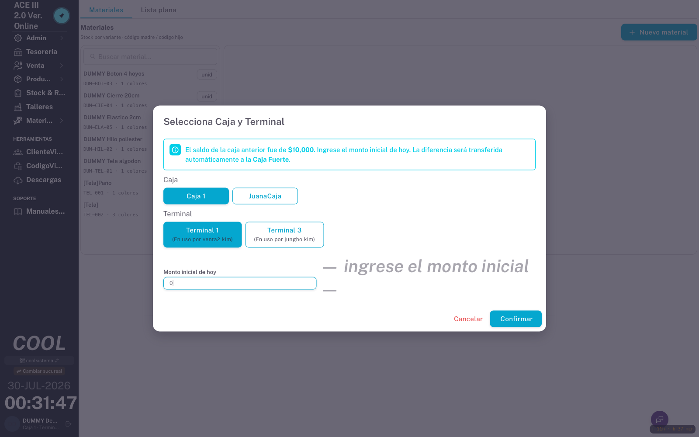
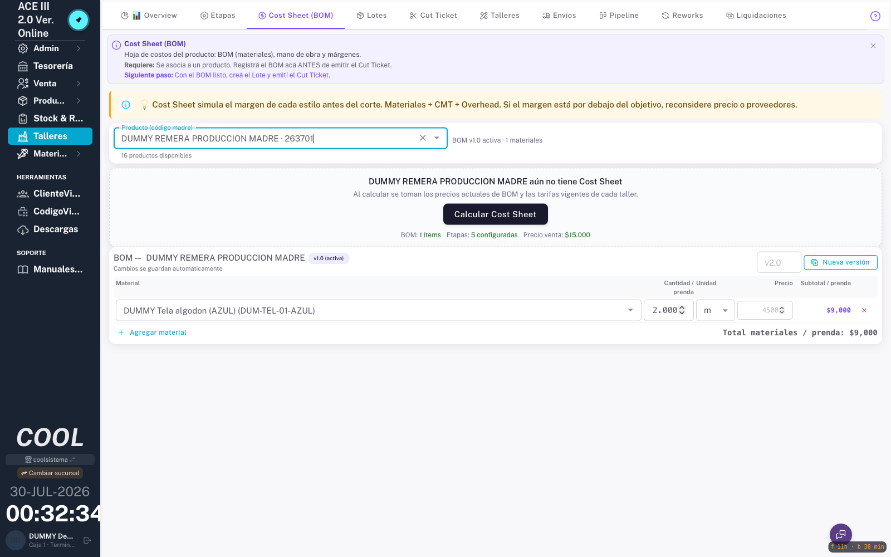
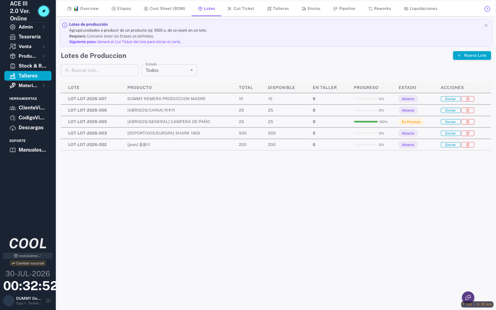
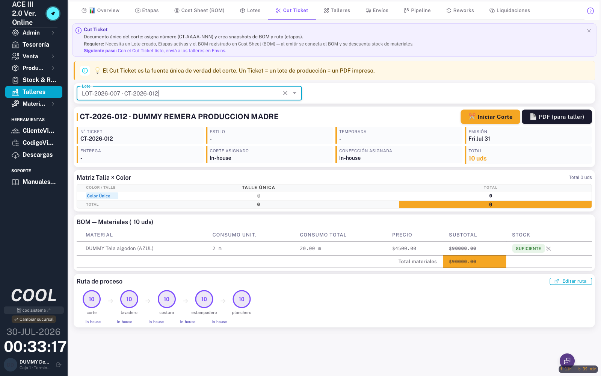
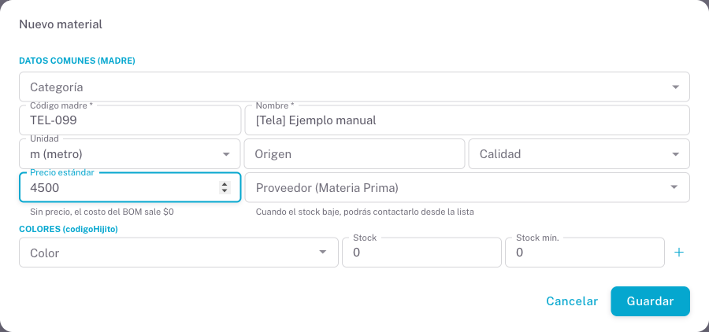
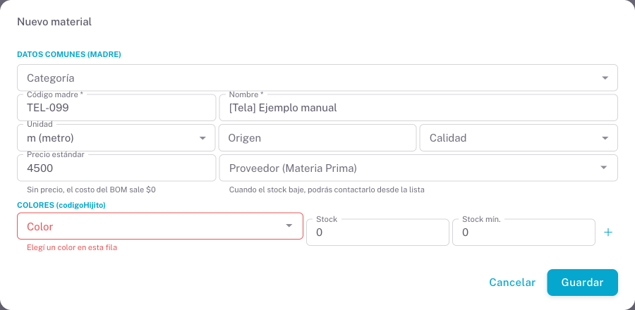
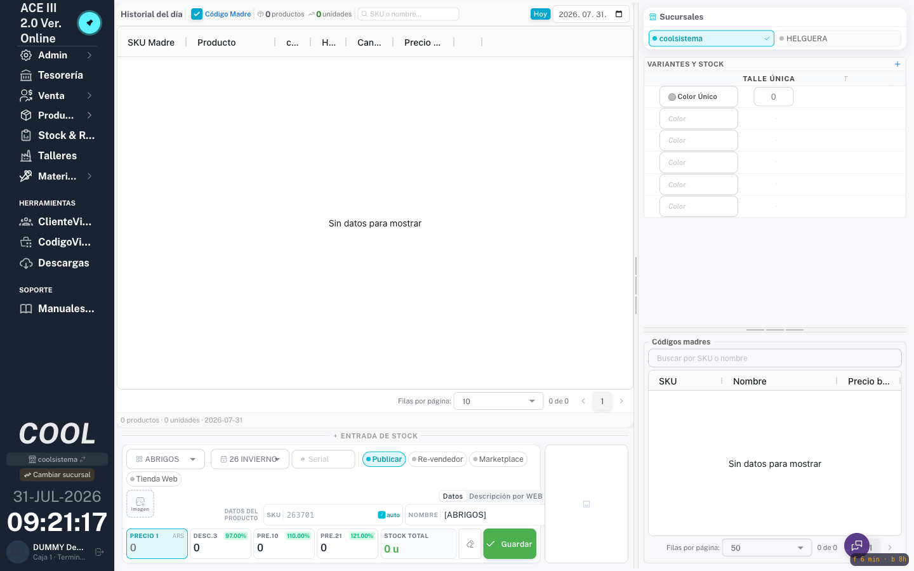
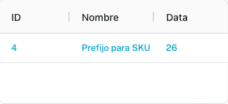

# 생산 흐름(Producción) 검증 매뉴얼

> **대상**: Ventago / ACE III — `app.coolsistema.com`
> **최초 작성**: 2026-07-31 · 최초 실행에서 흐름이 끝까지 도는 것을 확인함
> **목적**: 자재 → BOM → 로트 → Cut Ticket → 자재 소비까지 한 번에 검증한다.
> 새 매장을 열거나, 자재·BOM 관련 코드를 수정한 뒤 이 순서대로 다시 실행한다.

---

## 0. 핵심 개념 — 재고 카운터가 둘이다

이 시스템에는 **서로 다른 재고 저장소가 두 개** 있고, 서로 동기화되지 않는다.
헷갈리면 진단을 통째로 틀리게 하므로 먼저 익힌다.

| | 대상 | 테이블 | 줄어드는 시점 |
|---|---|---|---|
| **자재 재고** | 원단·부자재 | `mes_materials.current_stock` | **Cut Ticket 발행** |
| **상품 재고** | 완제품·변형 | `products.stock` (+ `stocks` 원장) | 판매·이동·생산완료 |

- 자재 소비의 **실사용 경로는 Cut Ticket** 이다(`talleres` 모듈).
- MES `작업지시(work-order)` 경로도 코드에 있으나 다른 저장소를 쓴다 —
  `products.sku = material.code` 인 **미러 상품**을 찾아 `stocks` 원장을 움직인다.
  미러 상품이 없으면 **경고 로그만 남기고 조용히 건너뛴다.** 운영에는 미러가 0건이므로
  이 경로는 사실상 비활성이다. 검증은 Cut Ticket 경로로 한다.

> **자재 소비가 0건이라고 곧 버그는 아니다.** 대부분 BOM 이 비어 있어서다.
> 2026-07-31 이전 운영 데이터가 정확히 그 상태였다(BOM 2건, 항목 0개, 소비 0건).

---

## 1. 사전 준비

### 1-1. 계정

**운영 계정(admin@cool)을 검증에 쓰지 말 것.** `active_sessions` 는 유저당 1개라
같은 계정으로 로그인하면 **실사용자가 즉시 튕긴다.**

검증용 계정을 따로 만든다. BOM·로트·Cut Ticket 은 `@Auth(admin, superadmin, gerente)` 이므로
**`gerente` 역할**이 필요하다.

| 항목 | 값(예시) |
|---|---|
| 사용자 | `depogte@dummy.test` |
| 비밀번호 | `dep1010` |
| 역할 | `gerente` |
| 매장 / 지점 | coolsistema(6) / coolsistema(6) |

> ⚠️ `inventory_clerk`(창고 담당) 역할로는 **로그인 직후 `/unauthorized/` 로 튕긴다.**
> `ValidRoles` 에 매핑이 없는 역할(`inventory_clerk`·`accountant`·`viewer`)은 앱을 못 쓴다.
> 이 검증에는 반드시 `gerente` 를 쓴다.

### 1-2. 새 기기 대화상자

처음 로그인하면 `Nuevo dispositivo detectado` 가 뜬다 →
`Mover desde un terminal existente` → 사용 중이 아닌 터미널 선택 → `Mover a este terminal`.

### 1-3. 캐하(Caja) 대화상자 — **절대 확인 누르지 말 것**

작업 중 `Selecciona Caja y Terminal` 이 반복해서 뜬다. `Monto inicial de hoy` 를 넣고
`Confirmar` 하면 **캐하가 개시되고 차액이 금고(Caja Fuerte)로 이체된다.**
검증 중에는 항상 **`Cancelar`** 를 누른다.

---

## 2. 검증 절차

각 단계마다 화면 결과와 **DB 확인 쿼리**를 함께 적었다. 화면만 믿지 말고 DB 로 확인한다.

DB 접속(읽기 전용):

```bash
ssh jhkim-server "sudo -u postgres psql -p 5434 -d ventago -A -F' | ' -c \"<SQL>\""
```

### 단계 1 — 공급업체 등록

`Materia Prima` → `Proveedores` → **`Nuevo Proveedor`**

| 칸 | 예시 |
|---|---|
| 업체명 | `DUMMY Textil Andina` |
| CUIT | `30-11111111-1` |
| 전화 | `011-4444-0001` |
| 담당자 | `Sr. Prueba Uno` |
| 결제조건 | `30 días` |

`Crear` → 목록에 나타나면 성공.


```sql
SELECT id, name, cuit FROM mes_material_suppliers
 WHERE store_id=6 AND name LIKE 'DUMMY%' ORDER BY id;
```

### 단계 2 — 자재 등록

`Materia Prima` → `Inventario` → **`Nuevo material`**

자재는 **madre + 색상(codigoHijito)** 구조다. 색상 행이 **최소 1개** 없으면 저장되지 않는다
(`Agregá al menos un color` 토스트만 뜬다).

| 칸 | 예시 |
|---|---|
| Código madre * | `DUM-TEL-01` |
| Nombre * | `DUMMY Tela algodon` |
| Unidad | `m (metro)` |
| Color | `AZUL` |
| Stock | `100` |
| Stock mín. | `20` |

> ⚠️ **`Precio estándar` 를 비워 두지 말 것.** 비우면 `standard_price` 가 0 으로 저장되고
> **BOM 원가·마진이 전부 $0** 으로 나온다. 3행(Unidad · Precio estándar · Stock · Stock mín.)에 있다.
> `Proveedor (Materia Prima)` 도 같은 폼에서 지정한다(2026-07-31 부터 신규 등록에도 노출).



```sql
SELECT id, code, name, unit, standard_price, supplier_id, current_stock
  FROM mes_materials WHERE store_id=6 AND code LIKE 'DUM%' ORDER BY id;
```

기대: madre 행 + 색상 자식 행이 각각 생성되고, 재고는 **색상 자식**에 붙는다.

### 단계 3 — 완제품(madre) 상품 등록

`Productos` → 폼에 `NOMBRE`, `PRECIO 1` 입력 → **`Guardar`**

BOM 은 **`código madre` 상품에만** 걸린다. 자식 상품은 BOM 목록에 나오지 않는다.

```sql
SELECT id, sku, name, serial, str_prefix FROM products
 WHERE store_id=6 AND name ILIKE 'DUMMY%' ORDER BY id;
```

> ⚠️ **여기서 막히는 경우가 많다.** `Se alcanzó el máximo de 99 en este grupo` 오류가 뜨면
> SKU 시리얼 카운터가 상한(99)을 넘은 것이다. 아래 「알려진 제약 ①」 참조.

### 단계 4 — BOM 작성

`Talleres` → **`Cost Sheet (BOM)`** 탭

1. `Producto (código madre)` 드롭다운에서 단계 3 의 상품 선택
2. **`Crear BOM v1.0`**
3. **`Agregar material`** → 자재 선택(재고가 있는 **색상 자식** 을 고른다)
4. `Cantidad / prenda` 입력 (예: `2`)

변경은 자동 저장된다(`Cambios se guardan automáticamente`).

**확인 포인트**: `Precio` 와 `Subtotal / prenda` 가 채워지는지.
`$0` 이면 그 자재의 `standard_price` 가 비어 있다는 뜻이다.



```sql
SELECT bi.id, bi.material_id, bi.quantity, bi.unit
  FROM mes_bom_items bi JOIN mes_bom b ON b.id=bi.bom_id
 WHERE b.product_id=<상품ID>;
```

### 단계 5 — 로트 생성

`Talleres` → `Lotes` → **`Nuevo Lote`**

| 칸 | 예시 |
|---|---|
| Producto * | 단계 3 의 상품 |
| Cantidad Total * | `10` |



```sql
SELECT id, lote_number, product_id, total_quantity, cut_ticket_number
  FROM talleres_lotes WHERE product_id=<상품ID>;
```

### 단계 6 — Cut Ticket 발행 ★ 자재가 소비되는 지점

**발행 전 자재 재고를 먼저 기록한다.**

```sql
SELECT id, code, current_stock FROM mes_materials WHERE id=<자재ID>;
```

`Talleres` → `Cut Ticket` 탭 → 로트 선택 → **`✂️ Configurar y Generar Cut Ticket`**
→ 공정 순서 확인(corte → lavadero → costura → estampadero → planchero) → **`Configurar y Generar`**



---

## 3. 기대값 — 이 표와 다르면 회귀다

BOM 수량 `Q`(벌당), 로트 수량 `N` 일 때:

| 확인 항목 | 기대값 |
|---|---|
| `talleres_lotes.cut_ticket_number` | `CT-YYYY-NNN` 부여됨 |
| `mes_material_movements` 신규 행 | `type='SALIDA'`, `quantity = Q × N` |
| 그 행의 `reference` | 발행된 `CT-YYYY-NNN` (추적성) |
| `mes_materials.current_stock` | **발행 전 − (Q × N)** |

### 2026-07-31 최초 실행 실측

| 항목 | 값 |
|---|---|
| 상품 | `263701` (id 308) |
| BOM | `DUM-TEL-01-AZUL` **2 m/벌**, Subtotal $9.000 |
| 로트 | `LOT-2026-007`, **10벌** |
| Cut Ticket | **`CT-2026-012`** |
| 자재 이동 | `SALIDA 20.000`, `reference=CT-2026-012` |
| 자재 재고 | **100 → 80** (= 2 × 10 차감) |

**흐름 정상 동작 확인.**

### 실패 판정

- `SALIDA` 행이 안 생김 → BOM 에 자재 항목이 없다(가장 흔함). 단계 4 를 다시 본다
- `quantity ≠ Q × N` → 소비량 계산 결함
- `current_stock` 이 안 줄어듦 → `consumeMaterialsFromBom` 트랜잭션 실패. API 로그 확인
- 같은 Cut Ticket 으로 `SALIDA` 가 2건 → **이중 차감**

```bash
ssh jhkim-server "docker logs --since 10m api_ventago 2>&1 | grep -a consumeMaterialsFromBom | tail -10"
```

---

## 4. 알려진 제약 — 처리 상태 (2026-07-31 갱신)

| # | 제약 | 상태 |
|---|---|---|
| ① | SKU 시리얼 카운터 오염 | **복구 SQL 작성** — `api-ventago/migrations/sku-serials-recalc.sql`, 운영 적용 대기 |
| ② | `prefix` 빈 값 전송 400 | **수정됨** — 프론트가 prefix 로딩 전 호출 안 함 + 서버가 매장 설정으로 보완 |
| ③ | 자재 폼 단가·공급업체 | **수정됨** — 단가는 원래 있었음(오기), 공급업체를 신규 등록에도 노출 |
| ④ | 캐하 대화상자 반복 | **수정됨** — 조회 실패 시에도 "오늘 이미 닫음"을 존중해 하루 1회만 |
| ⑤ | 색상 미입력 원인 불명확 | **수정됨** — 문제 행의 `Color` 칸이 빨갛게 + 사유 문구 |

### ① SKU 시리얼 카운터 오염 — 상품 생성 차단

`sku_serials.last_serial` 에 `category_id × 10` 이 들어간 그룹이 있다(2026-07-16 백필 추정).
코드 상한은 `MAX_SERIAL = 99` 라 카운터가 이미 초과 → **자동 SKU 상품 생성 불가.**

```sql
SELECT store_id, count(*) 그룹수, count(*) FILTER (WHERE last_serial > 99) 초과그룹, max(last_serial)
  FROM sku_serials GROUP BY store_id ORDER BY store_id;
```

실측: store 6 은 12개 중 **10개**, store 11 은 3개 중 1개가 초과.

**임시 우회**: `Configuración` → `Productos` 탭 → `Parámetros` 표 →
`Prefijo para SKU` 행의 `Editar` → 값을 올린다(`25` → `26`).
새 prefix 는 새 시리얼 그룹이라 1부터 시작해 즉시 풀린다.

**근본 복구 (SQL 준비 완료, 운영 적용 대기)**: `api-ventago/migrations/sku-serials-recalc.sql`
카운터를 **그 그룹에서 실제로 쓰인 최대 serial** 로 되돌린다. `products.serial` 도 같은 백필로
오염돼 있으므로(>99) **1~99 범위 값만** 신뢰하고, 없으면 0(다음 발급 = 1)으로 둔다.
적용 대상 11개 그룹(사전 조회 결과):

| store | prefix | category | 전 | 후 |
|---|---|---|---|---|
| 6 | 25 | 10·20·27·28·29·30·31·32·37·43 | 102~430 | **0** |
| 11 | 25 | 56 | 560 | **5** |

적용 후 그 그룹의 신규 SKU 는 `2527` + `01` … 형태로 시작한다. 구 SKU(`250627001…`,
supplier 3자리 + serial 3자리)와 문자열이 겹치지 않는 것을 사전 조회로 확인했다(0건).

```bash
ssh jhkim-server "sudo -u postgres psql -p 5434 -d ventago -v ON_ERROR_STOP=1 -f -" \
  < api-ventago/migrations/sku-serials-recalc.sql
```

### ② `prefix` 빈 값 전송 — 400 → **수정됨 (2026-07-31)**

증상: `GET /products/next-serial?prefix=&supplierId=0&...` → `prefix es requerido` 붉은 배너.
상품 생성 자체는 성공했지만(서버가 자체 prefix 사용) 사용자에게는 오류로 보였다.

수정 두 겹:
- 프론트(`BasicDataCard`): prefix 가 아직 로드되지 않았으면 next-serial 을 **아예 호출하지 않는다.**
  prefix 가 도착하면 그때 재조회한다.
- 서버(`products.service.getNextSerial`): prefix 가 비어 와도 400 대신 **매장 설정(`prefix-sku`)으로 보완**한다.
  어차피 상품 생성은 서버 prefix 로 조립하므로 미리보기만 오류를 낼 이유가 없다.

### ③ 자재 폼 단가·공급업체 → **수정됨 (2026-07-31)**

- **단가 칸은 원래 있었다** — 폼 3행 `Precio estándar`. 최초 매뉴얼의 "칸이 없다"는 기술은 오기다.
  비워 두면 0 으로 저장돼 Cost Sheet 원가가 $0 이 된다(그래서 없는 것처럼 보였다).
- **공급업체 칸은 편집 모드에만 있었다** → 신규 등록 폼에도 노출하도록 수정.
  없으면 재고 부족 시 연락처를 찾을 수 없고 매입 단가를 공급자 기준으로 못 묶는다.

### ④ 캐하 대화상자 반복 차단 → **수정됨 (2026-07-31)**

원인: `/cash-register/status` 조회가 실패하면(권한 없음·터미널 미배정 등) 프론트가
**조건 없이 모달을 다시 열었다.** 화면을 옮길 때마다 레이아웃이 다시 마운트되므로 계속 떴다.
수정: 실패 경로에서도 "오늘 이미 닫음"(localStorage) 을 존중해 **하루 1회**만 뜬다.
검증 중에는 여전히 `Cancelar` 로 넘긴다(§1-3).

### ⑤ 색상 미입력 시 저장 실패 원인 불명확 → **수정됨 (2026-07-31)**

`Agregá al menos un color` 토스트만 뜨던 것을, **문제 행의 `Color` 칸을 빨갛게** 표시하고
그 아래에 사유 문구를 남기도록 바꿨다. 색상 중복도 같은 방식으로 표시한다.

---

## 5. 시범 운행 주의사항 (2026-07-31 실행에서 실제로 걸린 것들)

한 번 걸리면 원인을 찾는 데 시간이 오래 걸린 항목만 모았다. 순서대로 확인한다.

### 5-1. 자재 등록 — 단가를 비우면 원가가 통째로 $0

`Materia Prima` → `Inventario` → `Materiales` 탭 → `Nuevo material`.
**`Precio estándar` 를 반드시 채운다.** 비우면 0 으로 저장되고, 그 자재를 쓰는
Cost Sheet(BOM)의 `Precio` · `Subtotal / prenda` · 마진이 전부 $0 으로 나온다.
`Proveedor (Materia Prima)` 도 여기서 지정한다 — 재고가 바닥났을 때 연락처를 찾는 경로다.



> 이 두 칸은 2026-07-31 에 추가됐다. 그 이전에 만든 자재는 `standard_price` 가 비어 있으니
> 목록에서 자재를 열어 단가를 채워 넣어야 BOM 원가가 산출된다.

### 5-2. 색상은 최소 1개 — 안 고르면 저장되지 않는다

자재는 **madre + 색상(codigoHijito)** 구조라 색상 행이 최소 1개 필요하다.
비운 채 `Guardar` 하면 해당 `Color` 칸이 빨갛게 변하고 사유가 그 아래에 뜬다.
색상을 두 행에 같은 값으로 넣어도 같은 방식으로 막힌다(자식 code 가 충돌하기 때문).



### 5-3. 상품 등록 — SKU 는 서버가 발급한다

`Productos` 화면의 `SKU` 칸은 `auto` 상태에서 서버가 자동 조립한다.
붉은 오류 배너 없이 번호가 채워지면 정상이다.



`Se alcanzó el máximo de 99 en este grupo` 가 뜨면 그 그룹(prefix+카테고리)의 카운터가
99 를 넘긴 것이다. 2026-07-31 에 오염된 카운터 11개를 복구했으므로 지금은 정상이지만,
같은 그룹에 99개를 채우면 다시 만난다. 그때는 prefix 를 올린다:
`Configuración` → `Productos` 탭 → `Parámetros` → `Prefijo para SKU` 의 `Editar`.



### 5-4. 계정과 대화상자 — 검증을 막는 두 가지

- **운영 계정으로 로그인하지 말 것.** `active_sessions` 는 유저당 1개라 실사용자가 즉시 튕긴다(§1-1).
- `Selecciona Caja y Terminal` 은 **항상 `Cancelar`** — `Confirmar` 하면 캐하가 개시되고
  차액이 금고로 이체된다(§1-3). 2026-07-31 수정으로 하루 1회만 뜬다.
- `inventory_clerk` · `accountant` · `viewer` 역할은 로그인 직후 `/unauthorized/` 로 튕긴다.
  검증 계정은 반드시 **`gerente`** 로 만든다.

### 5-5. 자재가 줄지 않으면 BOM 부터 본다

Cut Ticket 을 발행했는데 `mes_material_movements` 에 `SALIDA` 가 없으면
거의 항상 **BOM 에 자재 항목이 없다.** 화면은 정상으로 보이므로 §3 의 쿼리로 확인한다.
BOM 자재는 **재고가 붙어 있는 색상 자식**을 골라야 한다(madre 행에는 재고가 없다).

---

## 6. 정리 (검증 후)

검증 데이터는 `DUMMY` / `DUM-` 접두를 붙여 만든다. 정리 시:

```sql
-- 확인용 조회 (삭제 전 반드시 대상 확인)
SELECT id, code, name FROM mes_materials WHERE code LIKE 'DUM%';
SELECT id, name FROM mes_material_suppliers WHERE name LIKE 'DUMMY%';
SELECT id, sku, name FROM products WHERE name ILIKE 'DUMMY%';
SELECT id, lote_number FROM talleres_lotes WHERE product_id IN (...);
```

> **판매는 지울 수 없다.** 검증 중 판매가 생겼다면 화면에서 **anular**(역분개) 한다.
> 자재 이동(`mes_material_movements`)도 원장이므로 지우지 말고 반대 이동으로 상쇄한다.

`Prefijo para SKU` 를 바꿨다면 원래 값으로 되돌릴지 결정한다 —
되돌리려면 ①의 카운터 문제를 먼저 해결해야 상품 생성이 가능하다.

---

## 부록 — 한 번에 확인하는 쿼리

```sql
SELECT
  (SELECT count(*) FROM mes_materials  WHERE store_id=6)            AS 자재,
  (SELECT count(*) FROM mes_bom)                                     AS BOM,
  (SELECT count(*) FROM mes_bom_items WHERE material_id IS NOT NULL) AS BOM자재항목,
  (SELECT count(*) FROM talleres_lotes WHERE cut_ticket_number IS NOT NULL) AS CutTicket발행,
  (SELECT count(*) FROM mes_material_movements WHERE type='SALIDA')  AS 자재출고;
```

`BOM자재항목` 이 0 인데 `CutTicket발행` 이 있다면, 그 발행들은 **자재를 소비하지 않았다.**
